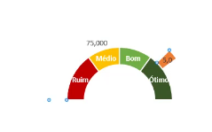

# Excel

- [Gráficos no Excel](#gráficos-no-excel)
- [Dashboard no Excel](#dashboard-no-excel)
- [Dicas do Excel](#dicas-do-excel)

## Gráficos no Excel

- [Gráfico de Velocímetro](#gráfico-de-velocímetro)
- [Meta vs Realizado - Barra](#meta-vs-realizado---barra)
- [Meta vs Realizado - Linha](#meta-vs-realizado---linha)
- [Grafico com Barra de Rolagem](#grafico-com-barra-de-rolagem)
- [Grafico de Comparação](#grafico-de-comparação)
- [Gráfico de Funil de Vendas 1](#grafico-de-funil-de-vendas-1)
- [Gráfico de Funil de Vendas 2](#grafico-de-funil-de-vendas-2)
- [Imagens no Gráfico](#imagens-no-gráfico)

### Gráfico de Velocímetro

#### Dados necessários
- Para criar o velocímetro
  - Categorias (Ruim, Médio, Bom, Ótimo, etc)
  - Porcentagem
  - Intervalo
  - Total
- Para criar o ponteiro
  - Número digitado
  - Ponteiro
  - Valor Máximo

#### Passo a passo
##### Obter dados
- Definar os nomes e a quantidade de categorias.
- Na coluna **Intervalo** definir um valor de 0 a 100 de acordo com a categoria da linha selecionada.
- Na coluna **Porcentagem** utilizar as fórmulas com a lógica exibida na imagem abaixo (coluna C).
  
  cc

- Informar o número que será analisado.
- Em uma célula oculta converter o número anterior em porcentagem. (Valor do topico anterior / 100). A célula deve ser formatada como porcentagem.
- Informar o número correspondente a largura do ponteiro.
- No valor máximo utilizar a fórmula que está na imagem acima.

##### Criar os gráficos
- Selecionar os dados de categoria e %, inclusive o total.
- Inserir gráfico de rosca.
- Clicar com o botão direito no grafico de rosca em seguida em **Série de dados**.
- Mudar o **Angulo da primeira fatia** para 270.
- Selecionar no gráfico a parte inferior, que corresponde ao 100 do total e remover o preenchimento e a linha.
- Aumentar o **Tamanho do Orifício da Rosca** para 50%.
- Selecionar cada fatia da rosca e pintar de uma cor.
- Adicionar *Rótulo de dados*, que inicialmete irá mostrar números.
- Clicar em **Formatar Rótulos de Dados**, desmarcar *Valor* e marcar *Nome da Categoria*.

  

- Mudar a cor das fontes.
- Clicar com o botão direito no gráfico de rosca, em seguida em *Selecionar Dados* e editar conforme imagem abaixo.

  

- No gráfico novo, remover a linha e o preenchimento dos números que não são da largura do ponteiro, como nas imagems abaixo.

  
  

- Na parte do gráfico referente ao ponteiro, mudar a cor e remover rótulos desnecessários.
- Somente no gráfico correspondente ao ponteiro, alterar o tipo de gráfico para pizza

  

- Alterar o **Angulo da primeira fatia** do gráfico de pizza para 270, marcar a opção *Eixo secundário* e em *Explosão de Ponto* alterar para 12%.
- Adicionar *Rótulo de dados* no ponteiro. Em seguida selecionar o número gerado e alterar na barra de fórmulas  para que ele aponte para a célula oculta que contém a converção do número que será analisado. 
- E está pronto!

### Meta vs Realizado - Barra

#### Dados necessários

- Item mencionado
- Meta
- Atual

#### Passo a passo

- Selecione a base de dados.
- Clicar em Inserir / Gráficos / Todos os Gráficos / Barras / Barras Agrupadas.
- Selecionar as barras que representam os dados realizados.
- Clicar com botão direito sobre a barra e em seguida em **Formatar Série de Dados**.
- Em *Opções de Série* marcar a opção **Eixo Secundário**.
- Na **Largura do Espaçamento**, quanto menor o número mais grossa fica a barra.
  - Na barra da *Meta* insira 60%
  - Na barra do *Realizado* insira 220%
- Remover dados desnecessários, como por exemplo valores superiores e inferiores dos eixos.
- Altere as cores.
- E está pronto!

### Meta vs Realizado - Linha

#### Dados necessários

- Mês (Ou qualque outro item analizado)
- Resultado (No exemplo usei fórmula aleatória, mas em produção usaremos uma lista de dados que serão analisados)
- Verde (fórmula que verifica se a meta foi atingida)
- Vermelho (fórmula que verifica se a meta NÃO foi atingida)
- Meta

#### Passo a passo

- Criar fórmulas conforme imagem abaixo
  
  

- Selecionar a tabela e inserir um **Gráfico de Linhas com Marcadores**.
- O #N/D nas fómulas é importante porque é assim que o gráfico sabe que não deve exibir essa informação.
- Selecionar apenas os pontos referentes a coluna verde e alterar conforme imagens abaixo.
  
  

- Repetir as mesmas etapas com os pontos referentes a coluna vermelha.
- Selecionar a linha e editar conforme imagem abaixo.
  
- Alterar a cor da linha da meta.
- Nos pontos superiores e inferiores, adicionar *Rótulo de dados* e formatar as formas, cores e posições dos rótulos.
- Clicar com o direito no gráfico, em seguida em *Selecionar Dados* / Células Ocultas e Vazias e marcar a opção **Mostrar dados em linhas e colunas ocultas**. A partir daqui as colunas verde, vermelho e meta poderão ser ocultas sem que os dados delas sumam do gráfico.
  
- E está pronto!

### Grafico com Barra de Rolagem

#### Passo a passo

- Clicar em Desenvolvedor / Inserir / Barra de Rolagem
- Desenhar uma *Barra de Rolagem*
- Clicar com o direito e em *Formatar controle* conforme imagem abaixo.
  

- Copiar os títulos para uma área que não será exibida.
- Criar as fórmulas indicadas na imagem abaixo, para alterarmos os dados de acordo com o número de linha indicado na coluna, este é modificado através do movimento da barra de rolagem.
  

- Selecionar os dados indicados na imagem abaixo e insira um gráfico de linha.
  
- Formatar o gráfico conforme desejado.
- Criar a seguinte *Formação Condicional* conforme imagem abaixo.
  
- E está pronto!

### Grafico de Comparação

#### Dados necessários

- Dois "Candidatos"
- Uma lista de critérios

#### Passo a passo

- Selecionar do título do candidato 1 até o valor do último critério dele.
- Repetir o passo anterior para o candidato 2.
  
- No gráfico do "candidato 1", selecionar a porcentagem e  marcar a opção "Valores em Ordem Inversa".
- Remover as linhas das bordas dos dois gráficos.
- Inserir uma caixa de texto para cada critério e o vincular a célula correspondente, conforme imagem abaixo.
  
- Inserir um retângulo com cantos arredondados e sem preenchimento por volta dos dois gráficos.
- Selecionar os eixos e definir o mínimo e máximo dos valores dos critérios, ver imagem abaixo.
  

- Pressionar Ctrl + G, na janela que se abrirá, clicar em *Especial*, e na próxima tela marcar *Objetos*. Isso irá selecionar todos os objetos da aba atual.
- Clicar com o direito e em seguida em *Agrupar*
- E está pronto!

### Grafico de Funil de Vendas 1

#### Dados necessários
- Itens do funil
- Quantidades ou Valores

#### Passo a passo

- Duplicar a coluna qtd duas vezes, a coluna ficará com 3 colunas qtd.
- A segunda e terceira coluna de qtd terão fórmula apontando para receberem o mesmo valor da primeira coluna qtd.
- Selecionar os dados da segunda coluna de qtd., clicar em *Formatação Condicional* / *Barra de dados* e escolher um dos estilos. Conforme imagem abaixo.

  
- Editar a regra da formatação condicional da segunda coluna de qtd. para que exiba a direção da barra da direita para a esquerda. Ver imagem abaixo.
  

  

- Inserir uma borda central com a mesma cor da formatação condicional.
- Mesclar os títulos da segunda e terceira qtd e chamar de Funil
  

- E está pronto!

### Grafico de Funil de Vendas 2

#### Dados necessários

- Itens do funil
- Quantidades ou Valores

#### Passo a passo

- Inserir a fórmula abaixo.
  
- Selecionar os dados.
- Inserir um gráfico de barras empilhado.
  
- Remover o fundo e a borda da barra que representa a coluna qtd. que possui fórmula.
  
- Inverter a exibição do gráfico.
  
- Aumentar a largura das barras.
  
- E está pronto!

### Imagens no Gráfico

#### Passo a passo
- Criar gráfico.
- Inserir a imagem desejada na planilha.
  
- Selecionar e copiar (CTRL + C) a imagem.
- Selecionar apenas as barras do gráfico.
- Colar a imagem (CTRL + V).
  
- Apagar a imagem importada.
- Alterar o preenchimento para *Empilhar*
- Alterar a *Largura do Espaçamento* até ficar bom de acordo com a imagem utilizada.
  
- A mesma técnica se aplica a outros tipos de gráfico.
  
  
### Gráfico de Meta com Imagem Indicando Meta Atingida
  

#### Dados Necessários
- Valor de Meta
- Data
- Valor
- Valor Acumulado
- Meta Atingida

#### Passo a passo
- Ver fórmulas abaixo.
  
- Selecionar a data, valor e meta atingida em e inserir um gráfico de colunas **empilhado**, precisa ser empilhado.
  
- O **1500** utilizado na fórmula é o responsavel por gerar a barra laranja no gráfico. Esse número deve diminuir caso os valores trabalhados sejam na casa de centenas ou deve aumentar caso os valores trabalhados sejam maiores. 
  
- Copiar a imagem da seta vermelha.
- Selecionar a barra que representa o 1500.
- Colar a imagem.
- E está pronto!

## Dashboard no Excel

## Dicas do Excel
  
